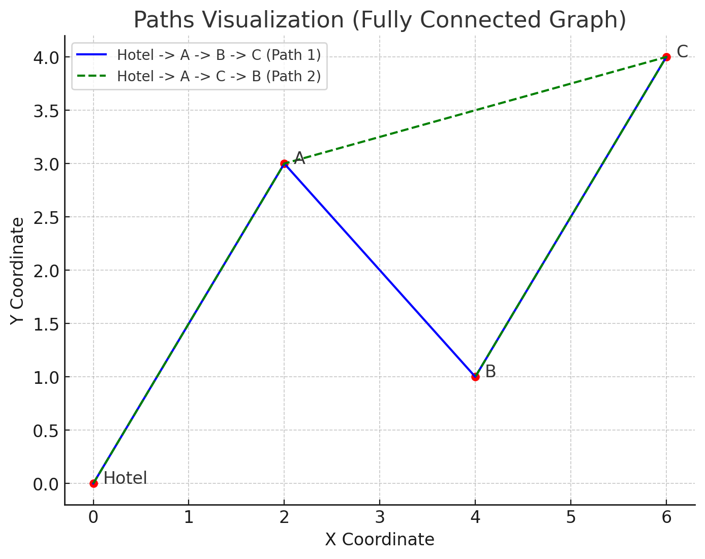

# Multi Destinations Trip Planner
This project is part of my master's study assessment for the course "Introduction to Artificial Intelligence," specifically focused on Chapter 4: Search Algorithms. The project, titled "Multi-Destination (Itinerary) Trip Planner," draws inspiration from travel apps like TripAdvisor. The system allows users to select a hotel and choose one of categories of interests. Based on these inputs, it generates a travel itinerary.

The hotel serves as the starting point, while the selected category filters relevant tourist attractions that align with the selected category. The itinerary will include up to five destinations, starting from the hotel to the first attraction, followed by routes between the subsequent attractions until the final stop. The trip plan is generated using the A* algorithm, with the Haversine formula employed as the heuristic function to calculate distances between destinations.

## Map Network
The map network is represented as a fully connected graph, where each point can directly connect to any other point, similar to what is seen in Google Maps.

In a fully connected graph, the total distance between the paths:
1. Hotel → A → B → C
2. Hotel → A → C → B

can be different, even though all nodes are directly connected. The difference arises due to the order in which the destinations are visited, which affects the total travel distance.

## A* Algorithm
In a fully connected graph, the heuristic helps prevent short-sighted decisions. Simple greedy algorithm would only look for the nearest spot at each step, but this could lead to suboptimal paths (e.g., jumping back and forth between distant spots).

A* doesn't just look at the immediate next step, it tries to guide the entire trip to minimize overall travel. It evaluates both how close a spot is now (`g(n)`) and how it impacts the rest of the trip (`h(n)`).

### Example
Let’s say the hotel is the starting point, and the spots are A, B, and C, all directly connected to each other and the hotel. Your goal is to visit 3 spots and return to the hotel.

1. Initial Step:

   - You calculate the actual distance from the hotel to each spot:
     - Hotel → A = 5 km
     - Hotel → B = 7 km
     - Hotel → C = 8 km
   - Now, the heuristic (`h(n)`) for each of these is the straight-line distance from A, B, and C to the nearest other spot.
     - `h(A)` = distance from A to nearest unvisited spot, say B.
     - `h(B)` = distance from B to nearest unvisited spot, say A or C.
     - `h(C)` = distance from C to nearest unvisited spot, say B or A.
   - Let’s say A is closest to the next unvisited spot B, so you might prefer A first because it will minimize the future cost (`f(A) = g(A) + h(A)`).

2. Subsequent Steps:

   - Once you visit A, A* recalculates the costs for the next move based on the remaining unvisited spots (B and C).
   - You choose the next spot that keeps the overall trip cost as low as possible.

## Scopes
The project scope includes the following constraints:
1. While real coordinates are used, the implementation does not follow actual routes. Instead, it calculates straight-line distances between the coordinates using Haversine formula.
2. Only distance will be considered as the cost for the trip planning algorithm.
3. The itinerary will be limited to a maximum of 5 destinations.
4. The data is limited to what is stored in the `hotels.json` and `tourism_spots.json` files.

## Deployment
This project is deployed as a web-based application and can be accessed via the following URL: https://multi-destinations-trip-planner-m4bksokoq.vercel.app
