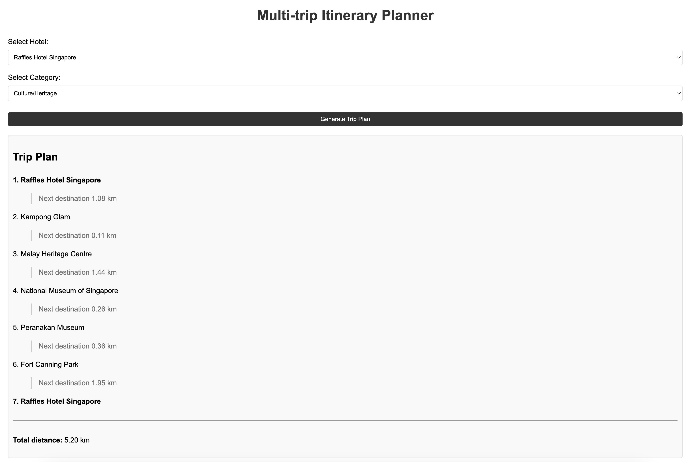

# Multi Destinations Trip Planner
This project is part of my master's study assessment for the course "Introduction to Artificial Intelligence," specifically focused on Chapter 4: Search Algorithms. The project, titled "Multi-Destination (Itinerary) Trip Planner," draws inspiration from travel apps like TripAdvisor. The system allows users to select a hotel and choose one of categories of interests. Based on these inputs, it generates a travel itinerary.

The hotel serves as the starting point, while the selected category filters relevant tourist attractions that align with the selected category. The itinerary will include up to five destinations, starting from the hotel to the first attraction, followed by routes between the subsequent attractions until the final stop. The trip plan is generated using the A* algorithm, with the Haversine formula employed as the heuristic function to calculate distances between destinations.

## Map
The data was manually collected from Google Maps and is limited to a selection of places in Singapore.


<br>

| #  | Hotels                                               | Latitude | Longitude |
|----|------------------------------------------------------|----------|-----------|
| 1  | Marina Bay Sands                                     | 1.2834   | 103.8607  |
| 2  | Raffles Hotel Singapore                              | 1.2933   | 103.8607  |
| 3  | The Fullerton Hotel Singapore                        | 1.2864   | 103.854   |
| 4  | Shangri-La Hotel Singapore                           | 1.3133   | 103.8302  |
| 5  | Mandarin Oriental Singapore                          | 1.289    | 103.860   |
| 6  | The Ritz-Carlton, Millenia Singapore                 | 1.2902   | 103.8607  |
| 7  | Parkroyal Collection Pickering                       | 1.2855   | 103.8495  |
| 8  | Hilton Singapore Orchard                             | 1.3081   | 103.8311  |
| 9  | Pan Pacific Singapore                                | 1.2903   | 103.8601  |
| 10 | Grand Hyatt Singapore                                | 1.3073   | 103.8328  |
| 11 | The St. Regis Singapore                              | 1.3071   | 103.8304  |
| 12 | Sofitel Singapore City Centre                        | 1.2804   | 103.847   |
| 13 | JW Marriott Hotel Singapore South Beach              | 1.2935   | 103.8608  |
| 14 | InterContinental Singapore                           | 1.2923   | 103.8556  |
| 15 | Orchard Hotel Singapore                              | 1.3081   | 103.8314  |
| 16 | Hotel Fort Canning                                   | 1.2904   | 103.8446  |
| 17 | Novotel Singapore Clarke Quay                        | 1.2884   | 103.8432  |
| 18 | The Quincy Hotel by Far East Hospitality             | 1.3077   | 103.8323  |
| 19 | The Warehouse Hotel                                  | 1.2817   | 103.8454  |
| 20 | Hotel G Singapore                                    | 1.3052   | 103.8499  |
| 21 | Hotel Jen Orchardgateway Singapore                   | 1.3083   | 103.8325  |
| 22 | Capri by Fraser Changi City Singapore                | 1.3417   | 103.9602  |
| 23 | Hotel Jen Tanglin Singapore                          | 1.3133   | 103.8204  |
| 24 | The Elizabeth Hotel                                  | 1.3084   | 103.8322  |
| 25 | The South Beach Singapore                            | 1.2935   | 103.8594  |
| 26 | Village Hotel Bugis by Far East Hospitality          | 1.3003   | 103.8607  |
| 27 | M Social Singapore                                   | 1.2931   | 103.8455  |
| 28 | The Lion Peak Hotel                                  | 1.2982   | 103.8499  |
| 29 | One Farrer Hotel                                     | 1.3077   | 103.8431  |
| 30 | Naumi Hotel Singapore                                | 1.2935   | 103.8566  |

<br>

| #  | Attractions                            | Latitude   | Longitude   |
|----|----------------------------------------|------------|-------------|
| 1  | Gardens by the Bay                     | 1.2815737  | 103.8610383 |
| 2  | Singapore Botanic Gardens              | 1.3138451  | 103.8133387 |
| 3  | MacRitchie Reservoir Park              | 1.3418663  | 103.8320634 |
| 4  | Bukit Timah Nature Reserve             | 1.3483937  | 103.7741261 |
| 5  | Pulau Ubin                             | 1.4171794  | 103.9004281 |
| 6  | Sungei Buloh Wetland Reserve           | 1.4464358  | 103.7208291 |
| 7  | Labrador Nature Reserve                | 1.2665148  | 103.7994900 |
| 8  | Coney Island                           | 1.4093514  | 103.9179981 |
| 9  | Southern Ridges                        | 1.2790148  | 103.8069313 |
| 10 | East Coast Park                        | 1.3007896  | 103.9096117 |
| 11 | Chinatown                              | 1.2829435  | 103.8441517 |
| 12 | Little India                           | 1.3068427  | 103.8492736 |
| 13 | Kampong Glam                           | 1.3027457  | 103.8583607 |
| 14 | Peranakan Museum                       | 1.2943723  | 103.8464642 |
| 15 | National Museum of Singapore           | 1.2966184  | 103.8459342 |
| 16 | The Esplanade – Theatres on the Bay    | 1.2897988  | 103.8532417 |
| 17 | Malay Heritage Centre                  | 1.3028047  | 103.8573516 |
| 18 | Thian Hock Keng Temple                 | 1.2809444  | 103.8450605 |
| 19 | Joo Chiat Road                         | 1.3055593  | 103.9026667 |
| 20 | Fort Canning Park                      | 1.2943930  | 103.8432284 |
| 21 | Orchard Road                           | 1.3031208  | 103.8313759 |
| 22 | Marina Bay Sands                       | 1.2834000  | 103.8607000 |
| 23 | Sentosa Island                         | 1.2489459  | 103.8343056 |
| 24 | Universal Studios                      | 1.2542009  | 103.8226670 |
| 25 | Arab Street                            | 1.3023080  | 103.8555870 |
| 26 | Tiong Bahru                            | 1.2849509  | 103.8228213 |
| 27 | Dempsey Hill                           | 1.3040470  | 103.8057486 |

The map network can be represented as a fully connected graph, where each point can directly connect to any other point, similar to what is seen in Google Maps.


In a fully connected graph, the total distance between the paths:
1. Hotel → A → B → C
2. Hotel → A → C → B

can be different, even though all nodes are directly connected. The difference arises due to the order in which the destinations are visited, which affects the total travel distance.

## A* Algorithm
In a fully connected graph, the heuristic helps prevent short-sighted decisions. Simple greedy algorithm would only look for the nearest spot at each step, but this could lead to suboptimal paths (e.g., jumping back and forth between distant spots).

A* doesn't just look at the immediate next step, it tries to guide the entire trip to minimize overall travel. It evaluates both how close a spot is now (`g(n)`) and how it impacts the rest of the trip (`h(n)`).

### Example
Let’s say the hotel is the starting point, and the spots are A, B, and C, all directly connected to each other and the hotel. Your goal is to visit 3 spots and return to the hotel.

1. Initial Step:

   - You calculate the actual distance from the hotel to each spot:
     - Hotel → A = 5 km
     - Hotel → B = 7 km
     - Hotel → C = 8 km
   - Now, the heuristic (`h(n)`) for each of these is the straight-line distance from A, B, and C to the nearest other spot.
     - `h(A)` = distance from A to nearest unvisited spot, say B.
     - `h(B)` = distance from B to nearest unvisited spot, say A or C.
     - `h(C)` = distance from C to nearest unvisited spot, say B or A.
   - Let’s say A is closest to the next unvisited spot B, so you might prefer A first because it will minimize the future cost (`f(A) = g(A) + h(A)`).

2. Subsequent Steps:

   - Once you visit A, A* recalculates the costs for the next move based on the remaining unvisited spots (B and C).
   - You choose the next spot that keeps the overall trip cost as low as possible.

## Solution State Space Representation
1. **States:** Represent the current location and visited locations. Example: currently at A and have visited the Hotel and A &#8594; `{"current": "A", "visited": ["Hotel", "A"]}`. 
2. **Initial State:** Starting at the hotel with no tourist spots visited. Example: `{"current": "Hotel", "visited": ["Hotel"]}`
3. **Goal State:** Reaching up to 5 destinations. Example for 5 destinations trip: `{"current": "E", "visited": ["Hotel", "A", "B", "C", "D", "E"]}` 
4. **Actions:** Moving between locations with a cost (distance), **current location** &#8594; **next location**.
5. **Transitions:** A state transition happens when you move from one location to another. Each transition has a cost, typically the distance between two locations. Example:

```
Transition from: {"current": "A", "visited": ["Hotel", "A"]}
To: {"current": "B", "visited": ["Hotel", "A", "B"]}

Cost: Distance A → B
```

6. **Cost Function:** Total distance `f(n) = g(n) + h(n)`. 
7. **Solution Path:** The sequence of states from start to goal, representing the trip plan. Example for 5 destinations trip:

```
1. {"current": "Hotel", "visited": ["Hotel"]} → Initial
2. {"current": "A", "visited": ["Hotel", "A"]}
3. {"current": "B", "visited": ["Hotel", "A", "B"]}
4. {"current": "C", "visited": ["Hotel", "A", "B", "C"]}
5. {"current": "D", "visited": ["Hotel", "A", "B", "C", "D"]}
6. {"current": "E", "visited": ["Hotel", "A", "B", "C", "D", "E"]} → Goal
```

## Scopes
The project scope includes the following constraints:
1. While real coordinates are used, the implementation does not follow actual routes. Instead, it calculates straight-line distances between the coordinates using Haversine formula.
2. Only distance will be considered as the cost for the trip planning algorithm.
3. The itinerary will be limited to a maximum of 5 destinations.
4. The data is limited to hotels and attractions tables above.

## Deployment
This project is deployed as a web-based application.

### How to Use
1. Follow this URL: https://multi-destinations-trip-planner.vercel.app
2. Select **Hotel** and **Category**.
3. Click **Generate Trip Plan**, then it will show up to 5 recommended destinations.

The output will be like this:

